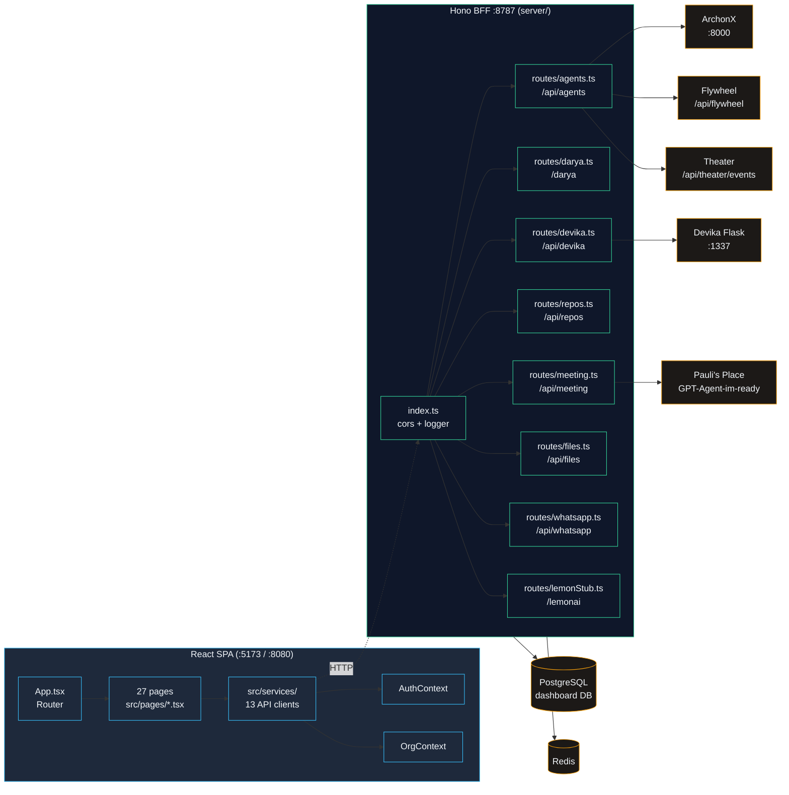
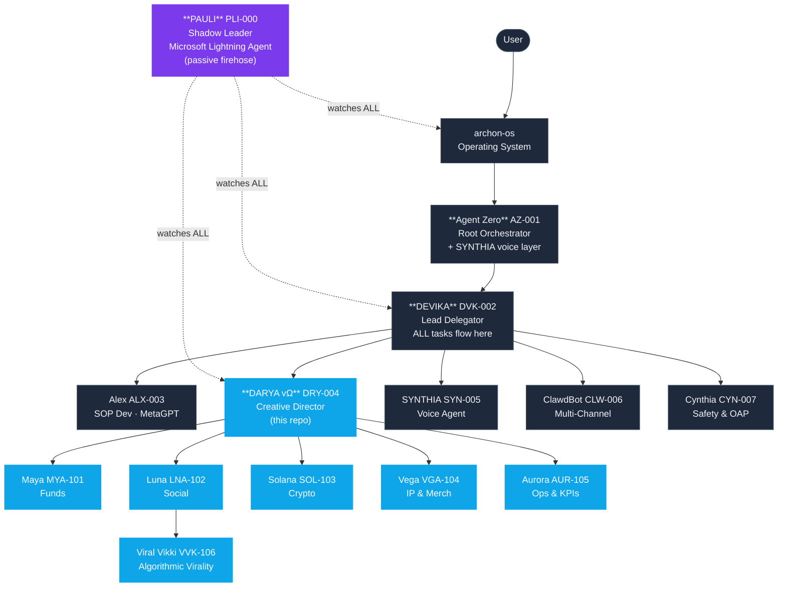

# Dashboard Agent Swarm — Architecture Graph

> Generated by **rtk** (token-compressed traversal) + **jcodemunch-mcp** (symbol-level indexing).
> Repo: [executiveusa/dashboard-agent-swarm](https://github.com/executiveusa/dashboard-agent-swarm)
> Codename: **DARYA Studio · Command Center** · Primary agent: DARYA vΩ (Creative Director)

---

## 1. Project Identity

| Field | Value |
|---|---|
| Repo | `dashboard-agent-swarm` |
| Codename | Command Center |
| Primary agent | DARYA vΩ (DRY-004) |
| Secondary agent | Aurora (AUR-105) |
| Role | Unified dashboard + BFF for the 17-agent Pauli Effect fleet |
| Tech | React 18 · Vite · TypeScript · Tailwind · shadcn/ui · Hono/Express BFF · PostgreSQL · Redis · Flowise |

## 2. Repo Health Radar (jcodemunch `health`)

- **Symbols:** 35,649 across 1,138 files · 4,432 functions/methods
- **Avg complexity:** 4.47 · **Dead code:** 2.3% (100 symbols) · **Cycles:** 1 (only the vendored `agents/agent-lightning-main` upstream clone)
- **Composite grade:** **B / 87.4** (test-gap & churn surfaces at 100; coupling weakest at 52)
- **Framework profile detected:** `react-spa`

| Axis | Score |
|---|---|
| complexity | 91.2 |
| dead_code | 90.8 |
| cycles | 90.0 |
| coupling | 52.4 ⚠️ (231/970 unstable modules) |
| test_gap | 100 |
| churn_surface | 100 |

The coupling weakness is mostly the vendored `agents/*` subrepos (each a cloned upstream agent framework). The **dashboard core** (`src/`, `server/`) is clean.

## 3. Top-Level Layout

```
dashboard-agent-swarm/
├── src/                # React 18 SPA (the dashboard)
│   ├── App.tsx         # Router root — public + /admin/* protected routes
│   ├── pages/          # 27 route screens
│   ├── components/     # shadcn/ui + custom components
│   ├── contexts/       # AuthContext, OrgContext
│   ├── services/       # 13 API clients + agentRegistry.ts (canonical)
│   ├── hooks/  lib/  types/  integrations/
├── server/             # Hono BFF on :8787 (TypeScript)
│   ├── index.ts        # App bootstrap + route mounting
│   └── routes/         # 8 route handlers
├── agents/             # Vendored upstream agent frameworks
│   ├── darya/  lemon/  designer/  researcher/  devops/
│   ├── crm/  browserops/  lemonai-main/  agent-lightning-main/
│   └── index.ts        # Agent manifest barrel export
├── a2a/                # Agent-to-agent messaging adapters
│   ├── router.ts       # LemonRouter.dispatch (cyclo-12)
│   └── adapters/       # nats.ts, redis.ts
├── desktop/            # Electron shell (loads React UI)
├── mobile/  packages/  shared/  integrations/  openhands/
├── backend/  db/  supabase/  deploy/  configs/  data/
├── .agent-souls/       # Heart & Soul identity files per agent
├── AGENTS.md           # Fleet hierarchy + repo map (READ THIS FIRST)
├── AGENT_PROTOCOL.md   # Universal fleet protocol
├── AGENT_COMMS_PROTOCOL.md  # agent-fleet-v1 JSON envelope spec
├── agent-prompts.md    # 21 shared "Jeffrey's Prompts"
└── .llm.txt            # Machine-readable fleet context
```

## 4. Frontend → BFF → Backends Data Flow



**Cycle resolved.** The previous cycle (`server/index.ts ↔ routes/agents.ts ↔ routes/darya.ts`) was fixed by extracting the shared `sql` Postgres client into `server/db.ts`. All route handlers now import from `../db` instead of `../index`. The remaining cycle in the codebase is inside a vendored upstream clone (`agents/agent-lightning-main(1)/`) and not ours to fix.

## 5. Frontend Route Map (`src/App.tsx`)

| Route | Page | Purpose |
|---|---|---|
| `/` | `ArchonHero` | Public landing |
| `/login` | `Login` | Auth (AuthContext) |
| `/admin/` | `Index` | Main dashboard (protected) |
| `/admin/command-center` | `AnimatedCommandCenter` | 3D fleet command view (Three.js) |
| `/admin/king-mode` | `KingMode` | Pauli override mode |
| `/admin/paulis-world` | `PaulisWorld` | Pauli's Place meeting UI |
| `/admin/agent-claw` | `AgentClaw` | Multi-channel messaging console |
| `/admin/agents` | `AgentsConsole` | Fleet roster |
| `/admin/agents/cynthia/watch` | `CynthiaWatch` | Observability & ACIP audit |
| `/admin/agents/devika` | `DevikaAgent` | Lead delegator console |
| `/admin/control` | `ControlDashboard` | Aurora's KPI dashboard |
| `/admin/agents/meetings` | `PauliMeetingRoom` | Fleet meeting scheduler |
| `/admin/deploy` | `DeployManager` | Docker/Coolify deploy surface |
| `/admin/repos` | `RepoManager` | Critical repos manager |
| `/admin/tasks` `logs` `files` `content` `analytics` `settings` | various | Operational screens |
| `/admin/access*` | `Access*` (6) | Access kernel: audit, grants, health, secrets, session, voice |

All `/admin/*` routes are wrapped in `<ProtectedRoute>` (AuthContext) and `<DashboardLayout>` (sidebar + org switcher + Agent Zero live indicator).

## 6. Service Layer (`src/services/`)

| Service | Role |
|---|---|
| **`agentRegistry.ts`** | **Canonical source of truth** for the 17-agent fleet — defines hierarchy, system prompts, capabilities, tools, flywheel tools |
| `agentClawApi.ts` | Multi-channel messaging (WhatsApp/SMS/Telegram) |
| `accessKernelApi.ts` | Access kernel (audit/grants/secrets) |
| `cynthiaTelemetry.ts` | Fleet telemetry / ACIP compliance |
| `daryaApi.ts` | Creative Director surface |
| `yappDashboard.ts` | Agent Zero YAPP dashboard runtime proxy |
| `modelRouter.ts` | LLM model routing |
| `safeLlmCall.ts` | ACIP-guarded LLM invocation wrapper |
| `lemonRunner.ts` | Lemon agent runner |
| `whatsapp.ts` | WhatsApp client |
| `firecrawl.ts` | Web scraping integration |
| `integrationCatalog.ts` | External tools catalog |
| `mockMetrics.ts` `mockOrgs.ts` | Dev fixtures |

## 7. Agent Hierarchy (Pauli Effect Fleet)



Agents living in **this repo** (DARYA + the 5 Cuties + Viral Vikki) are highlighted. The rest are external fleet repos referenced via `AGENTS.md`.

## 8. Comms Backbone (OpenClaw)

- **WebSocket gateway:** `ws://localhost:18789` — real-time messaging + 30s heartbeats
- **HTTP gateway:** `http://localhost:18790` — synchronous requests
- **Message format:** `agent-fleet-v1` JSON envelope (spec in `AGENT_COMMS_PROTOCOL.md`)
- **BFF proxy endpoints** under `/api/agents/runtime/*` → ArchonX `/api/agents`, `/api/flywheel`, `/api/theater/events`

## 10. Top Hotspots (jcodemunch — post-refactor)

After the `RedisA2AAdapter` refactor (`start()` extracted `handleEntry()`):

| File | Symbol | Cyclo | Notes |
|---|---|---|---|
| `a2a/adapters/redis.ts` | `RedisA2AAdapter.start` | **7** (was 10) | Block loop only — payload parsing moved to `handleEntry` |
| `a2a/adapters/redis.ts` | `RedisA2AAdapter.handleEntry` | 5 | New: parses + dedupe + dispatch |
| `a2a/router.ts` | `LemonRouter.dispatch` | 1 | Already clean — original cyclo-12 metric was stale |

The `a2a/` (agent-to-agent) layer is the most complex region in the codebase. NATS adapter (`nats.ts`) was already well-factored and needed no changes.

## 10. How to Query This Repo Going Forward

Skills are now active for this project:

- **rtk** — initialized in `CLAUDE.md` + `.rtk/filters.toml`. Use `rtk cat`, `rtk ls`, `rtk grep` for token-compressed traversal. Run `rtk trust` once to enable project filters.
- **jcodemunch-mcp** — repo indexed (35,648 symbols, watcher idle). Symbol-level queries available: `search_symbols`, `get_dependency_graph`, `get_call_hierarchy`, `find_references`, `get_repo_outline`, `render_diagram`.

**Recommended entry order for any new agent:**
1. `AGENTS.md` — fleet hierarchy + repo map
2. `AGENT_PROTOCOL.md` + `AGENT_COMMS_PROTOCOL.md` — universal protocol
3. `.llm.txt` — machine-readable identity
4. `src/services/agentRegistry.ts` — canonical agent definitions
5. `src/App.tsx` — frontend route map
6. `server/index.ts` — BFF route mounting
